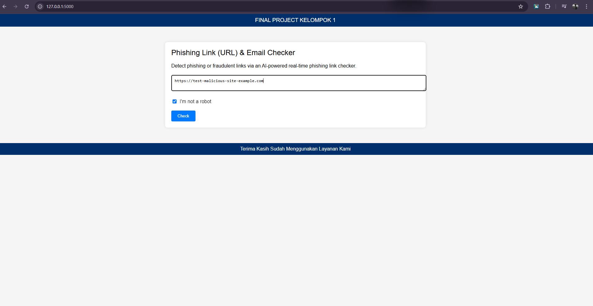

# Phishing Link (URL) & Email Checker --- Kelompok 1

Proyek ini adalah aplikasi web sederhana yang memungkinkan pengguna untuk memeriksa link apakah berpotensi phishing atau tidak menggunakan VirusTotal API.

## Fitur
- Memeriksa keamanan link menggunakan VirusTotal API.
- Menampilkan hasil pemeriksaan langsung kepada pengguna.

## Persyaratan
- Python 3.x
- Flask
- requests
- validators

## Instalasi

1. Buat dan aktifkan lingkungan virtual (opsional tetapi direkomendasikan):
    ```bash
    python -m venv FlaskEnv
    FlaskEnv\Scripts\activate  # Windows
    source FlaskEnv/bin/activate  # MacOS/Linux
    ```

2. Instal dependensi:   
    ```bash
    pip install flask requests validators
    ```

## Menjalankan Aplikasi
1. Jalankan server Flask:
    ```bash
    python app.py
    ```

2. Buka browser dan akses [http://127.0.0.1:5000](http://127.0.0.1:5000) untuk melihat aplikasi.

## Struktur Proyek
```
    final-project/
    │
    ├── app.py  # Kode backend Flask
    ├── templates/
    │   └── index.html  # Halaman HTML frontend
    └── README.md  # Dokumen ini
```

## Penjelasan Kode 
1. app.py
    Mengimpor modul yang diperlukan:
    ```python
    from flask import Flask, request, jsonify, render_template
    import requests
    import validators
    import base64
    ```

    Membuat aplikasi Flask:
    ```python
    app = Flask(__name__)
    ```

    Mendefinisikan API key untuk VirusTotal:
    ```python
    API_KEY = '7534c65ca1b5107b0294f82a81bc6fda602853aadfeadad0814e92a5455c2f07'  # Ini adalah API key Anda
    ```

    Route untuk menampilkan halaman utama:
    ```python
    @app.route('/')
    def index():
        return render_template('index.html')
    ```

    Route untuk memeriksa link:
    ```python
    @app.route('/check_link', methods=['POST'])
    def check_link():
        data = request.get_json()
        url = data['url']
        
        # Validasi URL
        if not validators.url(url):
            return jsonify({'error': 'Invalid URL'}), 400

        # Encode URL menjadi base64 (sesuai dengan persyaratan VirusTotal API)
        url_id = base64.urlsafe_b64encode(url.encode()).decode().strip('=')
        
        # Logika pemeriksaan phishing menggunakan VirusTotal API
        headers = {
            'x-apikey': API_KEY
        }
        response = requests.get(f'https://www.virustotal.com/api/v3/urls/{url_id}', headers=headers)
        result = response.json()
        
        # Memeriksa hasil dari API
        if 'data' in result and result['data']['attributes']['last_analysis_stats']['malicious'] > 0:
            return jsonify({'safe': False, 'message': 'Link berpotensi phishing'})
        else:
            return jsonify({'safe': True, 'message': 'Link aman'})
    ```

    Menjalankan aplikasi Flask:
    ```python
    if __name__ == '__main__':
    app.run(debug=True)
    ```

## Index.html
Halaman HTML yang memungkinkan pengguna memasukkan link untuk diperiksa:
```html
<!DOCTYPE html>
<html lang="en">
<head>
    <meta charset="UTF-8">
    <meta name="viewport" content="width=device-width, initial-scale=1.0">
    <title>Phishing Link (URL) & Email Checker</title>
    <style>
        body {
            font-family: Arial, sans-serif;
            background-color: #f5f5f5;
            margin: 0;
            padding: 0;
        }
        .header {
            background-color: #002f6c;
            color: white;
            padding: 10px 20px;
            display: flex;
            justify-content: center;
            align-items: center;
        }
        .header span {
            color: white;
            font-size: 18px;
        }
        .container {
            max-width: 800px;
            margin: 50px auto;
            background-color: white;
            padding: 20px;
            border-radius: 8px;
            box-shadow: 0 0 10px rgba(0, 0, 0, 0.1);
        }
        .title {
            font-size: 24px;
            margin-bottom: 20px;
        }
        .description {
            font-size: 16px;
            margin-bottom: 20px;
        }
        .input-group {
            margin-bottom: 20px;
        }
        .input-group input, .input-group textarea {
            width: 100%;
            padding: 10px;
            border: 1px solid #ccc;
            border-radius: 4px;
        }
        .captcha {
            display: flex;
            align-items: center;
            margin-bottom: 20px;
        }
        .captcha input {
            margin-right: 10px;
        }
        .button {
            background-color: #007bff;
            color: white;
            padding: 10px 20px;
            border: none;
            border-radius: 4px;
            cursor: pointer;
        }
        .button:disabled {
            background-color: #ccc;
        }
        .footer {
            text-align: center;
            padding: 10px 0;
            background-color: #002f6c;
            color: white;
            position: relative;
            bottom: 0;
            width: 100%;
        }
    </style>
    <script src="https://code.jquery.com/jquery-3.6.0.min.js"></script>
</head>
<body>
    <div class="header">
        <span>FINAL PROJECT KELOMPOK 1</span>
    </div>
    <div class="container">
        <div class="title">Phishing Link (URL) & Email Checker</div>
        <div class="description">Detect phishing or fraudulent links via an AI-powered real-time phishing link checker.</div>
        <div class="input-group">
            <textarea placeholder="Paste URLs or email original content here"></textarea>
        </div>
        <div class="captcha">
            <input type="checkbox" id="captcha">
            <label for="captcha">I'm not a robot</label>
        </div>
        <button class="button" disabled>Check</button>
    </div>
    <div class="footer">
        Terima Kasih Sudah Menggunakan Layanan Kami
    </div>
    <script>
        $(document).ready(function() {
            $('#captcha').change(function() {
                if (this.checked) {
                    $('.button').prop('disabled', false);
                } else {
                    $('.button').prop('disabled', true);
                }
            });

            $('.button').click(function() {
                const url = $('textarea').val();

                $.ajax({
                    url: 'http://127.0.0.1:5000/check_link',
                    type: 'POST',
                    contentType: 'application/json',
                    data: JSON.stringify({ url: url }),
                    success: function(response) {
                        if (response.safe) {
                            alert('Link aman');
                        } else {
                            alert('Link berpotensi phishing: ' + response.message);
                        }
                    },
                    error: function(error) {
                        alert('Terjadi kesalahan: ' + error.responseJSON.error);
                    }
                });
            });
        });
    </script>
</body>
</html>
```

# HASIL OUTPUT


